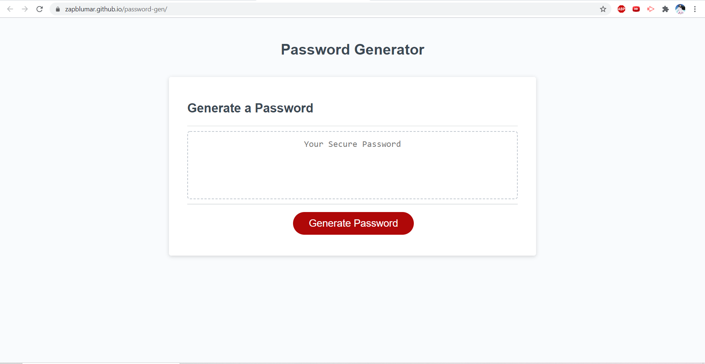

# Password-Gen

It is a random password generator that makes a password from what you selected and the length that you picked or a random length if you put a invalid number or letter.

## Getting Started

My Pasword Gen -
https://zapblumar.github.io/password-gen/

### Prerequisites


```
GIVEN I need a new, secure password.
WHEN I click the button to generate a password.
THEN I am presented with a series of prompts for password criteria
WHEN prompted for password criteria.
THEN I select which criteria to include in the password.
WHEN prompted for the length of the password.
THEN I choose a length of at least 8 characters and no more than 128 characters.
WHEN prompted for character types to include in the password.
THEN I choose lowercase, uppercase, numeric, and/or special characters.
WHEN I answer each prompt.
THEN my input should be validated and at least one character type should be selected.
WHEN all prompts are answered.
THEN a password is generated that matches the selected criteria.
WHEN the password is generated.
THEN the password is either displayed in an alert or written to the page.
```


## Running the tests

I ran the password gen and put a random number in it as a test and made sure it didn't fail if they tryed to put anything else in the box.

### Break down into end to end tests
```
I made sure that if someone tryed and but a 5 in the box it would not only have 5 units or didnt to anything.
I tryed to put a word in the box and made sure that wouldn't mess with the outcome.
```


## Built With

* VS Code
* git


## Acknowledgments

* the number-gen video
* some insperation from stack overflow.
* Jason Whitted

